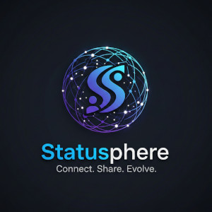

# Statusphere


> A high-performance Social Media Backend Engine

Statusphere is a RESTful API designed to power modern social networking platforms. It handles complex user relationships, media-rich posts, nested engagement (comments and reactions), and automated content scheduling.

### Key Features:
* **Advanced User System:** Email-based authentication with custom profiles and a non-symmetrical follow/follower system.
* **Smart Content:** Posts support media uploads, automatic hashtag extraction, and "Shared Post" (Repost) functionality.
* **Engagement Engine:** Nested comments and generic reactions (Like, Love, Wow, etc.) using `GenericRelations`.
* **Automated Scheduling:** Schedule posts for future publication using Celery and Redis.
* **Monitoring:** Includes Flower for monitoring Celery tasks at `http://localhost:5555`.

### Architecture


The project is split into two primary apps:
* **User App:** Manages custom authentication, profiles, and social graphs (followers).
* **Social Media App:** Manages posts, comments, hashtags, and the task-scheduling logic.

## Installing / Getting started

### Prerequisites
Ensure you have the following installed:
* Python (3.10+)
* Docker & Docker Compose
* Git

#### 1. Clone the repository
```shell
  git clone [https://github.com/Slava-Nykonenko/statusphere.git](https://github.com/Slava-Nykonenko/statusphere.git)
  cd statusphere
  python -m venv venv
```
#### For Windows:
```shell
  venv\Scripts\activate
```
#### For Mac/Linux:
```shell
  source venv/bin/activate
```

#### 2. Run with Docker (Recommended)
Docker should be installed.

```shell
  docker-compose up --build
```

#### 3. Manual Installation (Development)

If running locally without Docker, ensure you have PostgreSQL and Redis 
running on your machine.
```shell
  python -m venv venv
  # Windows: venv\Scripts\activate | Mac/Linux: source venv/bin/activate
  pip install -r requirements.txt
  
  # Configure your environment (create a .env file or export variables)
  export DB_HOST=localhost
  export DB_NAME=statusphere
  export DB_USER=postgres
  export DB_PASSWORD=postgres
  export SECRET_KEY=your_secret_key
  
  python manage.py migrate
  python manage.py runserver
```
_**Note:** To use scheduling features locally, you must also start a worker: 
`celery -A statusphere worker -l info`_

#### DockerHub Image

You can pull the prebuilt image directly from DockerHub:

```shell
  docker pull slavanykonenko/statusphere-api:latest
```
### Demo Access

For quick testing, you can use the following default user:
- Email: ```user@example.ie```
- Password: ```user-password```

#### Authentication Flow
**Obtain Token:** POST /api/user/token/ with email/password.

**Authorize:** Include the access token in your headers: Authorization: Bearer <your-access-token>

**Explore:** Access the API at /api/user/me/ or via Swagger.

### Initial Configuration

* Create a superuser:
```shell 
  python manage.py createsuperuser
```

* **Register User:** POST /api/user/register/
* **Get Token Pair:** POST /api/user/token/
* **Token Refresh:** POST /api/user/token/refresh/
* **Logout (Blacklist):** POST /api/user/token/blacklist/
  
## Developing

Development prioritizes Test-Driven Development (TDD) and security. Ensure all 
business logic, especially transactional integrity for post interactions and 
social graph updates (follows/unfollows), is covered by tests.

Optimize database performance by using Django's `.select_related()` and 
`.prefetch_related()` strategically to prevent N+1 queries. All contributions 
must adhere to PEP 8 standards and strictly use atomic transactions to 
guarantee data consistency.

## Contributing

If you'd like to contribute, please fork the repository and use a feature 
branch. Pull requests are warmly welcome.

1. Fork the Project
2. Create your Feature Branch (`git checkout -b feature/AmazingFeature`)
3. Commit your Changes (`git commit -m 'feat: Add AmazingFeature'`)
4. Push to the Branch (`git push origin feature/AmazingFeature`)
5. Open a Pull Request

### Documentation and Schema

This project uses DRF Spectacular to automatically generate an OpenAPI 3.0 
(Swagger) schema.

**Raw Schema:**  
[http://127.0.0.1:8000/api/schema/](http://127.0.0.1:8000/api/schema/)

**Swagger UI:**<br>
View the interactive API documentation at: 
[http://127.0.0.1:8000/api/schema/swagger/](http://127.0.0.1:8000/api/schema/swagger/)

**Redoc:**<br>
View the clean, reference-style documentation at: 
[http://127.0.0.1:8000/api/schema/redoc/](http://127.0.0.1:8000/api/schema/redoc/)

### Deploying / Publishing

Deployment involves moving the containerized application to a production 
environment. Key steps include:
* **Reverse Proxy:** Use Nginx or Caddy for static file serving and SSL (HTTPS).
* **Security:** Ensure DEBUG=False and ALLOWED_HOSTS are configured.
* **Persistence:** Use Docker Volumes for PostgreSQL data.
* **Monitoring:** Utilize Flower to track task health and performance metrics.

## Links

- Repository: [GitHub](https://github.com/Slava-Nykonenko/statusphere)
- In case of sensitive bugs like security vulnerabilities, please contact
slava.nykon@gmail.com directly. We value your effort to improve the security 
and privacy of this project!
- Related projects:
  - https://github.com/Slava-Nykonenko/emerald-railroads
  - https://github.com/Slava-Nykonenko/skyway-airlines

## Author
Viacheslav Nykonenko<br>
[slava.nykon@gmail.com](mailto:slava.nykon@gmail.com)<br>
[GitHub](https://github.com/Slava-Nykonenko) |
[DockerHub](https://hub.docker.com/repositories/slavanykonenko) |
[LinkedIn](https://www.linkedin.com/in/viacheslav-nykonenko-49211b316/)<br>
+353 85 222 1534 <br>
Carlow, Ireland

## Licensing
The code in this project is licensed under [MIT license](LICENSE.txt).
